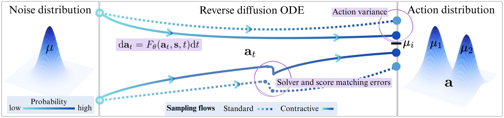
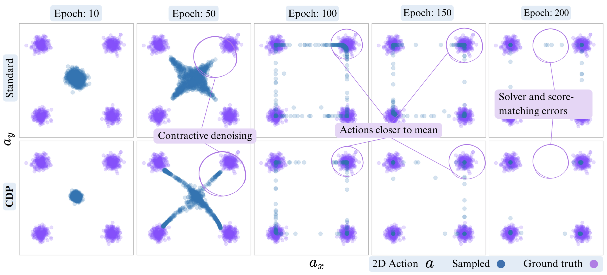

# Contractive Diffusion Policies (CDPs)

Implementation of contractive diffusion sampling process to improve policies for `offline policy learning`.

CDP aims to `improve diffusion policy's sample efficiency and general performance` by enforcing contraction constraints on the learned policy through Jacobian/eigenvalue regularization.

---
## Overview

Diffusion policies are widely-used generative models in robot learning that can be formulated with differential equations guided by a score function.

However, the same score-based modeling that provides diffusion policies with the flexibility to learn diverse behavior suffers from discretization and integration errors, requires large datasets for precise score matching, and experiences inconsistencies in action generation.

We propose CDP by promoting contraction in the reverse diffusion process to mitigate solver errors, and to reduces unwanted action variance during the sampling process.

### Example implementation
`CDP can be implemented by minimal modifications to ANY diffusion policy framework`, since our contribution targets the core diffusion sampling process.

```python
# Assuming a defined diffusion backbone during training
from cleandiffuser.nn_diffusion import DiT
nn_diffusion: DiT # TODO: Define charachteristics, such as embedding, hidden blocks, etc.

# Calculate the score jacobian
# Our theory (Theorem ) shows this is enough for enforcing contraction throughout the reverse diffusion process
score_jacobian = jacobian(nn_diffusion, action)

# Find the largest eigenvalue of the symmetric part
largest_eigenval = approx_largest_eigenval(sym(score_jacobian))

# Penalize and add it to the loss (simplistic version)
contraction_loss = ctr_coeff * relu((largest_eigenval + ctr_th) ** 2)
total_loss = diffusion_loss + contraction_loss
```

### Advantages of contractive sampling process
As we train CDP and standard policies, both methods produce
increasingly accurate samples. However, CDP samples tend to concentrate near the mean of distinct
action modes, effectively mitigating inaccuracies from both the solver and score matching.





---

## Setup Guide

### 1. Environment Setup

Create and activate a Conda environment:

```bash
# Create Python 3.9 environment
conda create -n cdp python=3.9

# Activate the environment
conda activate cdp
```

### 2. Install Clean Diffuser

This project relies on the [Clean Diffuser](https://github.com/CleanDiffuserTeam/CleanDiffuser) implementation for diffusion and conditioning architectures.

```bash
# (Optional) Create a directory for libraries
mkdir libs && cd libs

# Clone the Clean Diffuser repository
git clone https://github.com/CleanDiffuserTeam/CleanDiffuser.git
cd CleanDiffuser

# Install in editable mode
pip install -e .
```

### 3. Install D4RL

We use [D4RL](https://github.com/Farama-Foundation/D4RL) offline datasets for experiments.

```bash
# Install Mujoco-py dependencies, remove libgl1-mesa-glx for Ubuntu 24.04
sudo apt-get install libosmesa6-dev libgl1-mesa-glx libglfw3 libglew-dev patchelf

# Navigate to the libs directory if not already there
cd libs

# Clone and install D4RL
git clone https://github.com/Farama-Foundation/D4RL.git
cd D4RL
pip install -e .
```

If you get errors related to Mujoco, you can downgrade the version to 3.1.6 as shown below.

```bash
pip install "dm_control<=1.0.20" "mujoco<=3.1.6"
```

### 4. Install Robomimic

`Note` There exists an incompatiblity between MuJoCu for Robosuite and D4RL. Easiest fix for now is by cloning the previous conda environment for Robomimic experiments. Alternatively you can downgrade the dm_control package.

```bash
conda create --name cdp-il --clone cdp
```

And now install Robomimic:

```bash
# Install Robomimic 0.4.0 from source (recommended)
cd <PATH_TO_ROBOMIMIC_INSTALL_DIR>
git clone https://github.com/ARISE-Initiative/robomimic.git
cd robomimic
pip install -e .

# And Robosuite 1.5.0!
pip install robosuite=="1.5.0"
```
`Note` You need the robomimic datasets from the [website](https://robomimic.github.io/docs/v0.2/datasets/robomimic_v0.1.html) or opt for just building them in-place according to the instructions on the repository.
## Simple contractive runs
Running CDP on a selected D4RL task is just as simple as running the [cdp_rl.py](scripts/cdp_rl.py) file with proper arguments.

```python
python cdp_rl.py env_name="kitchen" task="kitchen-complete-v0" loss_type="jacobian" loss_weights.jacobian=1.0
```

And for running CDP on an imitation learning setup on Robomimic, try [cdp_il_lowdim.py](scripts/cdp_il_lowdim.py)

```python
python cdp_il_lowdim.py task="lift" loss_type="jacobian" loss_weights.jacobian=0.1
```

## Reproducing the results

To run all experiments for all subtasks of a certain benchmark, use one of the following scripts:

* [il_cdp.bash](il_cdp.bash): Running **CDP** built on top of **DBC** for Robomimic envs. Plain run yields **DBC-MLP** and **DBC-DiT** results.
* [il_baselines.bash](il_baselines.bash): Running **DP-Unet** and **DP-DiT** as baselines for Robomimic envs.
* [offline_rl_cdp.bash](offline_rl_exps.bash): Running **CDP** built on **EDP** for D4RL envs. Plain run yields **EDP** results.
* [offline_rl_baselines](offline_rl_baselines.bash): Running **DQL** and **IDQL** as baselines.

```bash
chmod +x il_cdp.bash
./il_cdp.bash <robomimic_environment> <seeds, default=5>

# e.g., single run of all experiments on low-dim robomimic lift, square, transport, and can tasks
./il_cdp.bash robomimic_lowdim 1
```

```bash
chmod +x offline_rl_cdp.bash
./offline_rl_cdp.bash <d4rl_environment> <seeds, default=5>

# e.g., single run of all experiments on kitchen mixed, partial, and complete tasks
./offline_rl_cdp.bash kitchen 1
```

### Terminating background processes

The script launches background jobs for better parallelization.
To kill these background processes, you can use ```pkill``` or just ```kill```. For instance ```pkill -9 -f kitchen``` for kitchen training processes or ```kill -9 <pid>``` if you have a specific process Id. Check list of processes with ```ps -aux | grep <part_of_env_name>```.

---
## Credits

This repository is built on [CleanDiffuser](https://github.com/CleanDiffuserTeam/CleanDiffuser). We use the tuned hyperparameters and diffusion and conditioning backbones provided by the repository.

The datasets comes from D4RL and Robomimic projects addressed earlier.

---

## Hydra Configurations

All experiments are managed via [Hydra](https://hydra.cc/). Configuration files can be found in the [configs](configs) directory.

---

## Contribution

We welcome contributions that improve our work! Please open an issue or submit a pull request.

---

## Authors

Anonymous authors.
